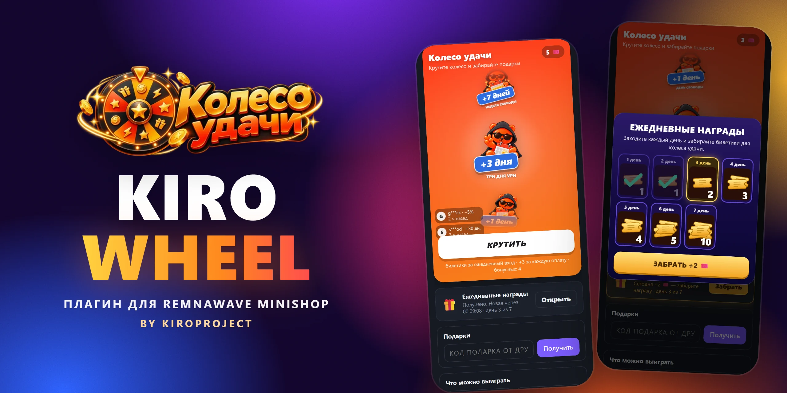
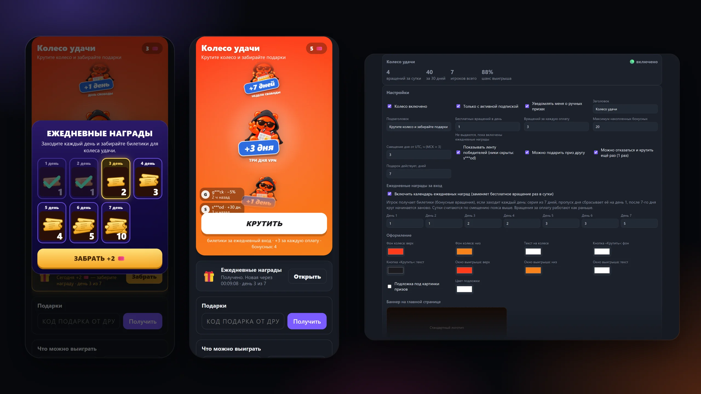
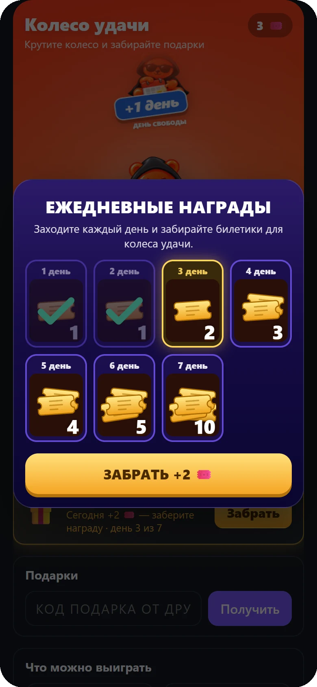
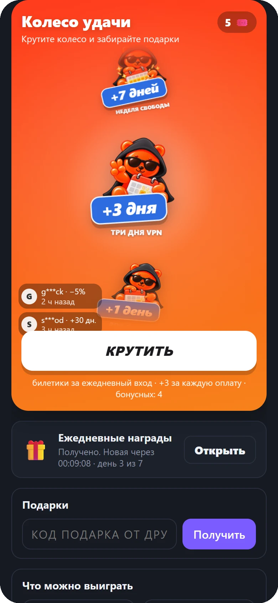
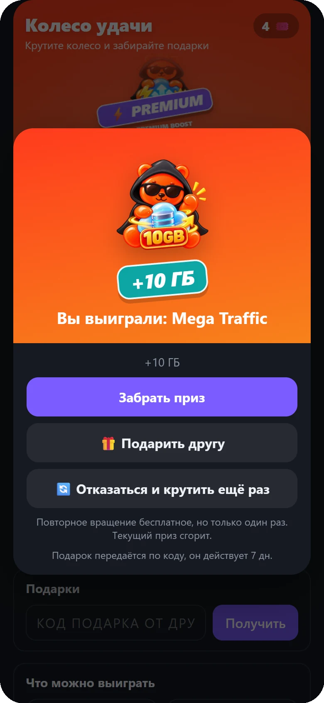
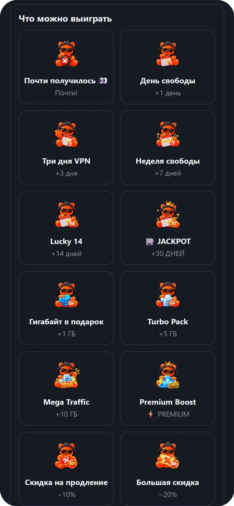
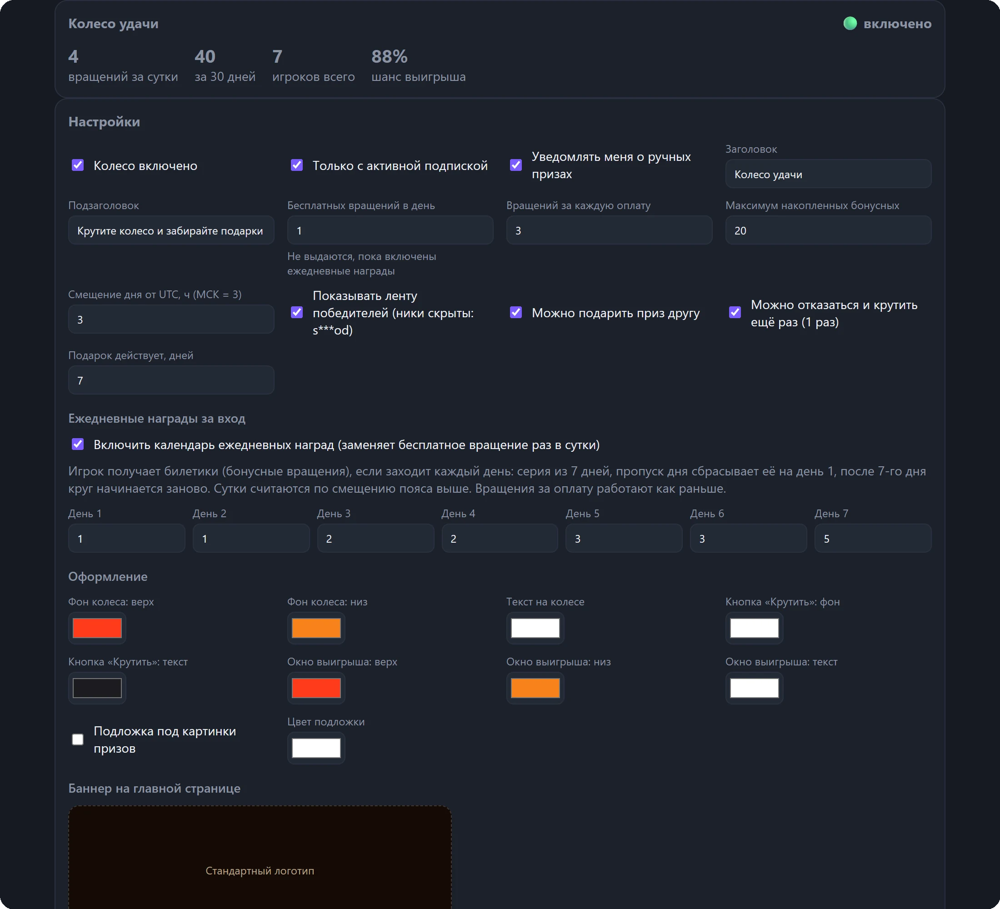
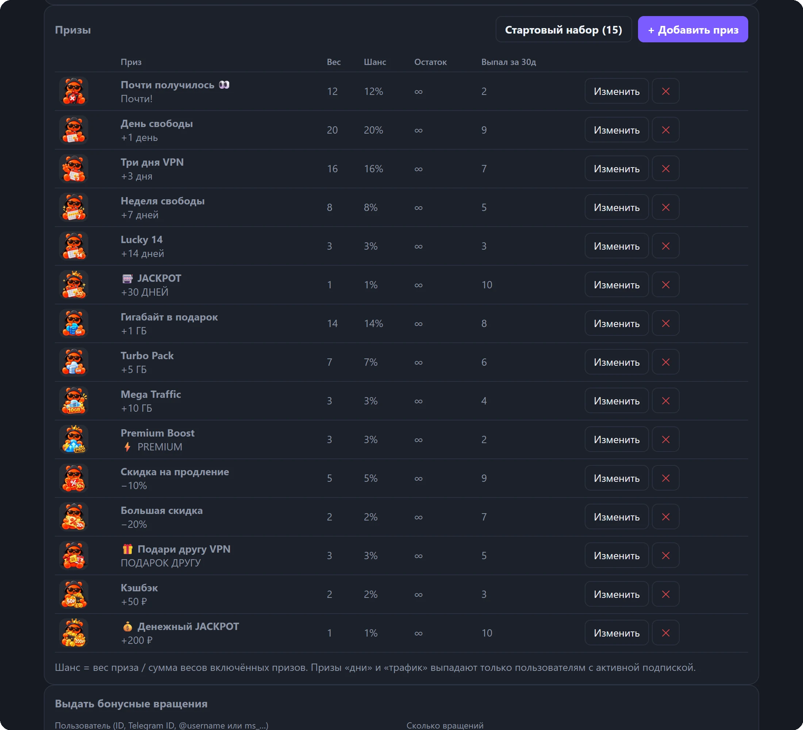

# KIRO Wheel — колесо удачи для Remnawave Minishop

> [!TIP]
> **Плагин работает в [MARMELAD VPN](https://app.kiroproject.online/?campaign=gh_wheel&utm_source=github&utm_medium=readme&utm_campaign=kiro-wheel).** Посмотрите колесо удачи вживую в Telegram-боте [@marmeladki_app_bot](https://t.me/marmeladki_app_bot?start=gh_wheel).

[](docs/cover.webp)

**KIRO Wheel** — плагин для [Remnawave Minishop](https://github.com/3252a8/remnawave-minishop), который добавляет в кабинет клиента колесо удачи и календарь ежедневных наград. Клиенты заходят каждый день за билетиками, получают дополнительные вращения за оплату и выигрывают дни подписки, трафик, скидки, деньги на баланс и подарочные коды. Всё настраивается в админке Minishop, без правок кода и без перезапуска бота.

Версия **1.8.0** · публикатор `kiroproject` · Minishop **3.8.0 и новее** (Plugin API v1, проверено на 3.8.0 и 3.8.1)

[](https://t.me/marmeladki_app_bot?start=gh_wheel)

## Возможности

* **Календарь ежедневных наград** — серия из 7 дней: за каждый заход игрок получает билетики (бонусные вращения), пропуск дня сбрасывает серию, после 7-го дня круг начинается заново. Награда за каждый день задаётся в админке.
* **Колесо удачи с призами-картинками** — анимированный барабан, всплывающее окно с выигрышем, стикеры и ярлыки на каждом призе.
* **Вращения за оплату** — каждая успешная оплата начисляет билетики, лимит накопления настраивается.
* **7 типов призов** — дни подписки, трафик, Premium-трафик, деньги на баланс, скидка (промокод), подарочный код и «ручной» приз, который выдаёт администратор.
* **Подарок другу** — выигранный приз можно передать по коду или ссылке, подарок действует заданное число дней и возвращается владельцу, если его отменить.
* **Повторное вращение** — отказаться от приза и крутить ещё раз (один раз на выигрыш).
* **Лента победителей** — последние выигрыши со скрытыми никами повышают интерес к колесу.
* **Баннер на главной** — карточка колеса под блоком бренда на главной странице кабинета: свой баннер 1080×360 или стандартный логотип, режим «на всю карточку».
* **Стартовый набор из 15 призов** — добавляется одной кнопкой, с готовыми иллюстрациями. Каждый приз можно изменить, отключить, ограничить остатком.
* **Гибкие шансы** — вес каждого приза, итоговый шанс считается автоматически; у каждого приза своя аудитория (без подписки, пробная, платная, конкретные тарифы); «дни» и «трафик» нельзя выдать без подписки.
* **Тема оформления** — цвета колеса, кнопки и окна выигрыша, подложка под картинки призов.
* **Админка** — статистика вращений и игроков, выдача бонусных вращений пользователю, список последних вращений, уведомления администраторам о ручных призах.
* **Журнал плагина** — ошибки, отказы и ключевые события колеса видны в админке и скачиваются одним файлом для разработчика; ID пользователей и коды подарков в файле скрыты.
* **Понятные причины отказа** — заблокированный аккаунт или отсутствующий профиль игрок видит сразу, с объяснением, а не общим «Доступ ограничен».
* **Надёжная работа** — выдача наград идемпотентна (двойной тап и повторный запрос не дублируют приз), лимит накопленных билетиков, сутки считаются по настраиваемому часовому поясу.

## Скриншоты

[](docs/overview.webp)

| Календарь наград | Колесо | Выигрыш |
| :---: | :---: | :---: |
|  |  |  |

| Каталог призов | Баннер на главной |
| :---: | :---: |
|  |  |

**Админка**

[](docs/screenshots/admin-settings.webp)

[](docs/screenshots/admin-prizes.webp)

## Как это работает

1. Клиент открывает **«Колесо удачи»** с карточки на главной странице или из раздела настроек кабинета.
2. Если включён календарь, при первом заходе за день появляется окно **«Ежедневные награды»**: кнопка «Забрать» начисляет билетики за текущий день серии.
3. Билетики тратятся на вращения. Дополнительные вращения начисляются за каждую оплату.
4. Выигрыш применяется сразу или остаётся в окне выбора: **забрать**, **подарить другу** или **отказаться и крутить ещё раз**.

> Когда календарь включён, бесплатное вращение раз в сутки не выдаётся — его заменяют ежедневные награды. Вращения за оплату работают как раньше.

### Типы призов

| Тип | Что получает игрок |
| --- | --- |
| Дни подписки | платному клиенту продлевают тариф на N дней; клиенту на пробном периоде триал заменяется платным базовым тарифом (настраивается) ровно на N дней с момента получения |
| Трафик | дополнительные ГБ трафика (нужна активная подписка); на пробном периоде добавляется только лимит трафика, остальное не трогается |
| Premium-трафик | ГБ Premium-трафика зачисляются сразу (как «пополнение Premium» в админке); только платным тарифам с Premium-сквадом |
| Баланс | деньги на внутренний баланс |
| Скидка | промокод на скидку N% с заданным сроком действия |
| Подарочный код | код на N дней, который можно подарить другому пользователю |
| Особый приз | выдаётся администратором вручную, администраторы получают уведомление |
| Без выигрыша | утешительный приз («Почти получилось») |

## Установка

Плагин подписан публикатором `kiroproject` и устанавливается из этого репозитория по Git. Репозиторий публичный, в корне лежит `minishop-plugin.json` со ссылкой на готовый ZIP и его контрольной суммой.

1. В админке Minishop откройте раздел плагинов и выберите установку из Git-репозитория.
2. Укажите адрес репозитория:

   ```
   https://github.com/kiroproject/kiro-wheel
   ```

3. Подтвердите установку и включите плагин. Миграции базы данных (таблицы призов, вращений, подарков и ежедневных наград) применяются автоматически.

Minishop проверяет репозиторий каждые 10 минут и предложит обновление, когда выйдет новая версия.

Готовые подписанные архивы каждой версии и краткий список изменений лежат на странице [Releases](https://github.com/kiroproject/kiro-wheel/releases), полная история в [CHANGELOG.md](CHANGELOG.md). Архив можно скачать и установить вручную через загрузку пакета в разделе плагинов.

### Требования

* Remnawave Minishop **3.8.0 или новее** с Plugin API v1 (проверено на 3.8.0 и 3.8.1);
* возможности ядра: `user_ui`, `ui_composition`, `durable_jobs`, `rewards`;
* публичный GitHub/GitLab-репозиторий (приватные репозитории Minishop не поддерживает).

## Быстрая настройка

1. **Админка → Колесо удачи → Призы и настройки.**
2. Нажмите **«Стартовый набор (15)»**, чтобы добавить готовые призы с картинками, и поправьте веса под свою экономику.
3. Включите **«Календарь ежедневных наград»** и задайте награды по дням (по умолчанию 1, 1, 2, 2, 3, 3, 5).
4. Задайте число вращений за каждую оплату и максимум накопленных бонусных вращений.
5. Загрузите свой баннер для главной страницы (1080×360, PNG или WebP, до 1 МБ) или оставьте стандартный.
6. Нажмите **«Сохранить настройки»**.

| Параметр | По умолчанию | Описание |
| --- | --- | --- |
| Календарь наград | выключен | награды за ежедневный вход вместо бесплатного вращения |
| Награды по дням | `1, 1, 2, 2, 3, 3, 5` | билетиков за каждый день серии |
| Вращений за оплату | 3 | сколько вращений начисляется за успешную оплату |
| Максимум бонусных | 20 | предел накопленных билетиков |
| Смещение дня от UTC | 3 | с какого часа начинаются новые сутки (МСК = 3) |
| Только с подпиской | включено | вращать колесо могут только пользователи с активной подпиской |
| Подарок действует | 7 дней | срок жизни подарочного кода |
| Подарок другу, повтор | включено | можно ли дарить приз и крутить повторно |

### Аудитория призов и пробный период

У каждого приза в админке задаётся «Кому доступен приз»: без подписки, пробная подписка, платная подписка (и при желании только конкретные тарифы из Minishop). Приз участвует в розыгрыше и в барабане только у тех игроков, чья категория подходит; проверка повторяется при получении приза и при активации подарка (по получателю). Старые призы после обновления доступны тем же игрокам, что и раньше.

Если приз «дни подписки» выпал игроку на пробном периоде, триал заменяется платным базовым тарифом (общий тариф в настройках, при необходимости свой в самом призе) на выигранное число дней с момента получения, как при ручной смене тарифа в админке. Остаток триала не прибавляется, повторный триал остаётся недоступным.

## Журнал и диагностика

Если у игрока что-то не работает, откройте **Админка → Колесо удачи → Журнал плагина** (внизу страницы).

* В журнал попадают ошибки и отказы (с кодом причины), вращения, ежедневные награды, подарки, начисления за оплату и действия администратора.
* **Скачать журнал** сохраняет текстовый файл: версия плагина, безопасные настройки, счётчики и записи от старых к новым. По умолчанию ID пользователей и коды подарков заменены псевдонимами (один человек получает одну метку внутри файла), можно снять галочку и выгрузить как есть.
* **Скопировать** кладёт тот же отчёт в буфер обмена, **Очистить** удаляет записи (призы и вращения игроков не затрагиваются).
* Галочка **«Подробный журнал»** в настройках добавляет записи о каждом запросе состояния игрока; включайте её на время разбора проблемы.
* Хранится не больше 5000 последних записей за 30 дней. Ошибки дублируются в логи бота (`kiro_wheel.journal`).

### Сообщения игроку

| Причина | Что видит игрок |
| --- | --- |
| `account_banned` | «Аккаунт заблокирован. Если это ошибка, напишите в поддержку» |
| `profile_not_found` | «Профиль не найден. Закройте приложение и откройте его снова» |
| `subscription_required` | нужна активная подписка |
| `prize_not_eligible` | приз недоступен для текущей подписки игрока (аудитория приза) |
| `premium_unavailable` | Premium-трафик доступен только на платном тарифе с Premium |
| `no_spins` | вращения закончились, показано время следующей награды |

## Для разработчиков

```
backend/kiro_wheel/    логика, хранилище, ежедневные награды, стартовый набор призов
frontend/customer/     экраны клиента (колесо, карточка на главной, строка в настройках)
frontend/admin/        раздел админки
tests/                 тесты календаря наград, журнала, аудиторий и призов на пробном периоде (временный PostgreSQL)
preview/index.html     автономная страница с заглушкой API для проверки интерфейса
```

Тесты календаря запускаются на встроенном PostgreSQL (нужны `pgserver`, `sqlalchemy[asyncio]`, `asyncpg`):

```bash
python tests/run_daily_tests.py
python tests/run_diag_tests.py
python tests/run_audience_tests.py
```

Страница `preview/index.html` отдаётся любым статическим сервером (из корня репозитория) и показывает клиентский и административный интерфейс с тестовыми данными.

## Лицензия

[MIT](LICENSE)
